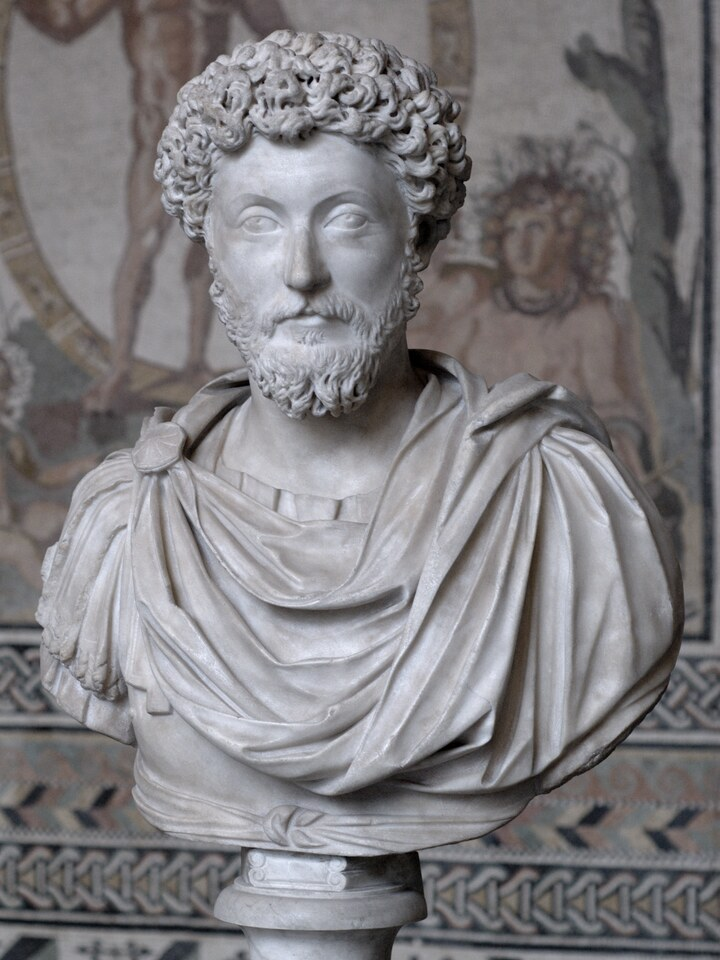

  

<h1 align="center">Aurelius</h1>

  <a href="#deutsch">Deutsch</a> · <a href="#english">English</a>

  
  &nbsp;
  
  &nbsp;
  

---

## Deutsch

Native Android-App für die großen Stoiker: Marc Aurels *Selbstbetrachtungen*
(**486 Abschnitte**), Epiktets *Handbüchlein der Moral* (**53 Kapitel**) und
Senecas *Von der Kürze des Lebens* (**20 Kapitel**) — jeweils auf Deutsch,
Englisch und im Original (Altgriechisch bzw. Latein), mit Autoren-Umschalter,
Themen-Filtern, Favoriten (lokal oder per Konto geräteübergreifend
synchronisiert) und optionalen KI-Erklärungen. Vollständig offline nutzbar,
keine Werbung, kein Tracking.

Kotlin + Jetpack Compose · minSdk 26 (Android 8.0) · Lizenz **GPL-3.0-or-later**

**Schwester-Projekte:** [aurelius](https://github.com/0xGI0/aurelius) (Web-App) ·
[aurelius-backend](https://github.com/0xGI0/aurelius-backend) (Konto- & Sync-Server)

### Installation

Aktuelle APK von den [Releases](https://github.com/0xGI0/aurelius-android/releases)
laden und öffnen („Unbekannte Quellen" einmalig erlauben). F-Droid-Aufnahme ist
in Vorbereitung.

**Download prüfen (optional, empfohlen):**

    sha256sum -c SHA256SUMS.txt                      # Prüfsumme
    gh attestation verify aurelius-*.apk \
      --repo 0xGI0/aurelius-android                  # Sigstore-Build-Nachweis

Die Attestierung beweist, dass die APK von der öffentlichen GitHub-Actions-
Pipeline aus genau diesem Quellcode gebaut wurde.

### Selbst bauen

    export JAVA_HOME=~/.jdks/temurin-21   # JDK 17+
    ./gradlew assembleDebug               # braucht Android-SDK (local.properties)
    ./gradlew test                        # JVM-Testsuite

Debug-Builds sprechen das Backend unter `http://10.0.2.2:8000` an (lokaler
Server, vom Emulator aus). Release-Signatur läuft über die Env-Vars
`AURELIUS_KEYSTORE` / `AURELIUS_KEYSTORE_PASS`; ohne sie entsteht ein
unsigniertes APK (so baut auch F-Droid).

### Quellen & Lizenzen der Inhalte

- Selbstbetrachtungen: Albert Wittstock (1879) · George Long (1862) · Perseus (grc, **CC BY-SA 4.0**)
- Handbüchlein: Carl Conz (1864) · George Long (1877) · Perseus (grc, **CC BY-SA 4.0**)
- Von der Kürze des Lebens: Otto Apelt (1923) · John W. Basore (1932, PD) · lateinisches Original
- Büste Marc Aurels: Glyptothek München, Foto Bibi Saint-Pol (gemeinfrei) · Epiktet-Stich: Oxford 1715 (gemeinfrei) · Pseudo-Seneca: Foto Marie-Lan Nguyen (**CC BY 2.5**)
- Schriften: Fraunces & GFS Didot (SIL Open Font License, siehe `licenses/`)

---

## English

Native Android app for the great Stoics: Marcus Aurelius' *Meditations*
(**486 sections**), Epictetus' *Enchiridion* (**53 chapters**) and Seneca's
*On the Shortness of Life* (**20 chapters**) — each in German, English and
the original (Ancient Greek or Latin), with an author switch, topic filters,
favorites (local, or synced across devices with a free account) and optional
AI explanations. Fully usable offline, no ads, no tracking.

Kotlin + Jetpack Compose · minSdk 26 (Android 8.0) · License **GPL-3.0-or-later**

**Sister projects:** [aurelius](https://github.com/0xGI0/aurelius) (web app) ·
[aurelius-backend](https://github.com/0xGI0/aurelius-backend) (account & sync server)

### Install

Grab the latest APK from the [Releases](https://github.com/0xGI0/aurelius-android/releases)
page and open it (allow "unknown sources" once). F-Droid inclusion is in
preparation.

**Verify your download (optional, recommended):**

    sha256sum -c SHA256SUMS.txt                      # checksum
    gh attestation verify aurelius-*.apk \
      --repo 0xGI0/aurelius-android                  # Sigstore build provenance

The attestation proves the APK was built by the public GitHub Actions
pipeline from exactly this source code.

### Build it yourself

    export JAVA_HOME=~/.jdks/temurin-21   # JDK 17+
    ./gradlew assembleDebug               # needs the Android SDK (local.properties)
    ./gradlew test                        # JVM test suite

Debug builds talk to the backend at `http://10.0.2.2:8000` (local server,
from the emulator). Release signing uses the env vars `AURELIUS_KEYSTORE` /
`AURELIUS_KEYSTORE_PASS`; without them the build is unsigned (which is how
F-Droid builds it).

### Content sources & licenses

- Meditations: Albert Wittstock (1879) · George Long (1862) · Perseus (grc, **CC BY-SA 4.0**)
- Enchiridion: Carl Conz (1864) · George Long (1877) · Perseus (grc, **CC BY-SA 4.0**)
- On the Shortness of Life: Otto Apelt (1923) · John W. Basore (1932, PD) · Latin original
- Bust of Marcus: Glyptothek Munich, photo Bibi Saint-Pol (public domain) · Epictetus engraving: Oxford 1715 (public domain) · Pseudo-Seneca: photo Marie-Lan Nguyen (**CC BY 2.5**)
- Fonts: Fraunces & GFS Didot (SIL Open Font License, see `licenses/`)
